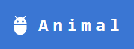

<h1 align="center"> Animal Dictionary </h1>

 
  

Welcome to the **Animal Dictionary**! 
This project is designed to provide children with a fun, engaging, and educational way to explore the animal kingdom. In a world with an increasing focus on online education, this website aims to make learning about animals accessible, interactive, and enjoyable for young users

## :bulb: Purpose

The Animal Dictionary offers a user-friendly platform where users can:

**Explore the Animal Kingdom:** Browse through a variety of animals with detailed descriptions and fascinating facts.
Interactive Learning with Data: Not only can users learn about animals, but they can also gain a broader understanding through data visualizations, adding a unique, educational twist.

## :woman_technologist:	Technologies Used

- **React:** The foundation of our user interface, providing dynamic, component-based structure.
- **Material-UI:** Enhances the design with accessible, customizable components.
- **Tailwind CSS:** Offers a flexible utility-first approach to styling, ensuring a responsive, visually appealing design.
- **TypeScript:** Adds type safety and improves code maintainability across the project.

<!-- CREDITS -->
<h2 id="credits"> :scroll: Credits</h2>

Hana Chae!

